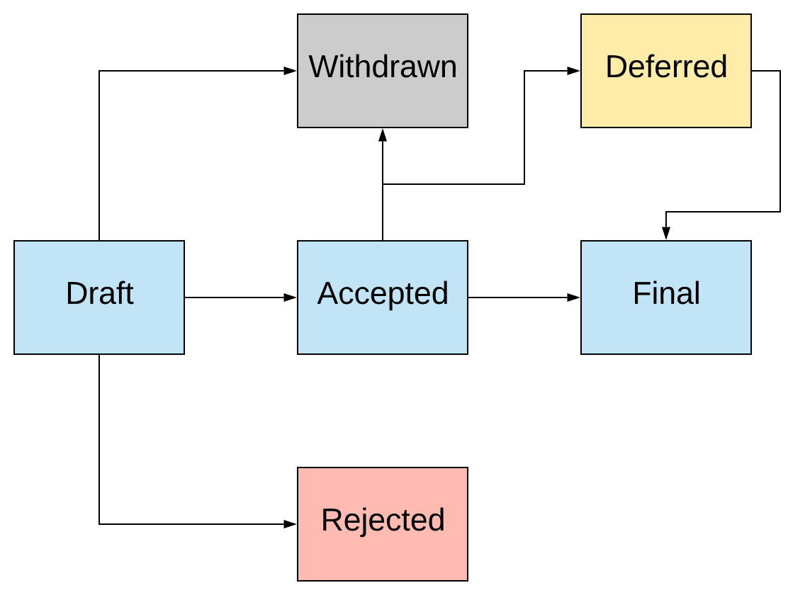

.. _IEP0000:

===================================
IEP0000 - What and how to use IEP's
===================================

:Author: `@tkknight`_
:Status: Draft
:Type: Process
:Created: 23/12/2020

Branches & Pull Requests
------------------------

TBC

Abstract
--------

An **Iris Enhancement Prosposal** (IEP) is a document detailing any significant
changes to Iris.  This would typically be outlining a design for a new or
revised approach to achieve a feature, however it may also be about how Iris is
configured, standards adopted and the supporting tools used.

Detail
------

The benefit of having IEPs is the transparency of proposed changes and in
future a way of presenting a future roadmap.

All IEP's will be held in the Iris git repository under the documentation
directory ``docs/iris/src/IEP``.

These IEPs have been inspired by the Python `PEPs`_ and various other Open
Source projects.

Types
^^^^^

There are three types of IEPs:

1. **Standard**.  A new feature or implementation for Iris.  This will mean the
   codebase will be changed.

2. **Informational**.  An item related to Iris that is useful to share to
   benefit users or developers of Iris.

3. **Process**.  A process may include procedures or guidelines.  For example
   the adoption of a particular coding standard, testing framework or
   standards (including data type standards).

IEP Workflow
^^^^^^^^^^^^

The author of each IEP owns the proposal and will be the primary contact for
progressing the proposal.  It is recommended that each IEP has a clear focus
to enable a concise proposal and easier understanding.  As with pull requests,
if the topic is not concise, break it into multiple ones.

* Before creating an IEP the author may consider raising the topic with the
  Iris core developers for some initial feedback via **@SciTools/developers** or
  contacting **(TBC..add links to the google groups dor users/devs?....).**

* The proposal should be submitted as a **draft** IEP via a GitHub pull
  request to the ``docs/iris/src/IEP`` directory with the name
  ``IEP9999-optional-title.rst``.  Note that the ``9999`` should be replaced
  with the next available number in sequence and an optional title may be
  included in the filename, for example ``IEP0001-support-xyz.rst``.  The
  :ref:`IEPXXXX_template` may be used when creating a new draft, it is
  recommended to copy and edit this file.

* If the IEP requires images, please create a suitable sub directory with
  appropriate name, for example
  ``docs/iris/src/IEP/IEP9999-optional-title/``.

* A pull request for the IEP should be created with the
  `Iris Enhancement Proposal label`_.  This pull request can now be used to
  start the discussion.  It is likely the IEP will not be perfect and updates
  to the pull request will be likely.

* The pull request may be merged once the IEP has been shared and recieved
  some feedback.  A merged pull request for an IEP does not mean it has been
  **accepted**, only that it is now available via the Iris documentation and
  may be discussed further and potentially progressed to **accepted**.

.. todo:: reference of @SciTools/developers is correct? then make it a link

.. todo:: create the project label

Workflow Status
^^^^^^^^^^^^^^^

All IEPs must have a valid status that is in the header of the IEP.  The valid
values for the status are:

* **Draft**.  The initial status for all IEPs.
* **Accepted**.  After discussion on the pull request it may be deemed
  appropriate to be accepted.  If the decision is not clear then see
  :ref:`accepted_decision`.
* **Rejected**.  Discussion has resulted it the IEP not being appropriate.
* **Withdrawn**.  The original author may decide the IEP is not suitable or
  appropriate and choose to withdraw it.
* **Deferred**.  If the IEP has no progress being made.
* **Final**.  Once the IEP has been implemented it may be marked as final.

   The status workflow

.. note:: The status of the IEP **only needs to be set in the IEP header**.
          The documentation will auto generate the index including the
          status headings.  If a status is used that is not one of the above
          listed :ref:`contributing.documentation.building` the Iris
          documentation will fail.

For completeness any pull request may link to an IEP, or if appropriate a
pull request may be linked in the IEP.

.. _accepted_decision:

How to be Accepted
^^^^^^^^^^^^^^^^^^

If a consensus is reached without any unresolved objections the IEP may be
marked as **Accepted**.  Objections may be addressed in the pull request
comments, however it may also need the Draft IEP to be update to reflect
the resolution to the objection.

If a consensus cannot be reached then the **SciTools Triumvirate** will be
used to decide.

.. todo:: this may be the first time the scitools triumvirate has been
          documented, may need fleshing out.

Header Format
^^^^^^^^^^^^^

In order for the indexing of the IEPs to function correctly and to make
easier to digest, each IEP must have a standard header.  This is shown
in the :ref:`IEPXXXX_template`.

Implementation
--------------

A Makefile and python scripts will be present in the ``docs/iris/src/IEP``
folder and will be run when :ref:`contributing.documentation.building` the
Iris Documentation.  As this is the first IEP this script will be part of the
pull request.

Backward Compatibility
----------------------

N/A

Miscellaneous
-------------

I expect the IEP process to evolve over time.

.. _@tkknight: https://github.com/tkknight
.. _PEPs: https://www.python.org/dev/peps/
.. _Iris Enhancement Proposal label: https://github.com/SciTools/iris/pulls?q=is%3Apr+label%3A%22Iris+Enhancement+Proposal%22+
